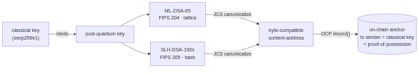
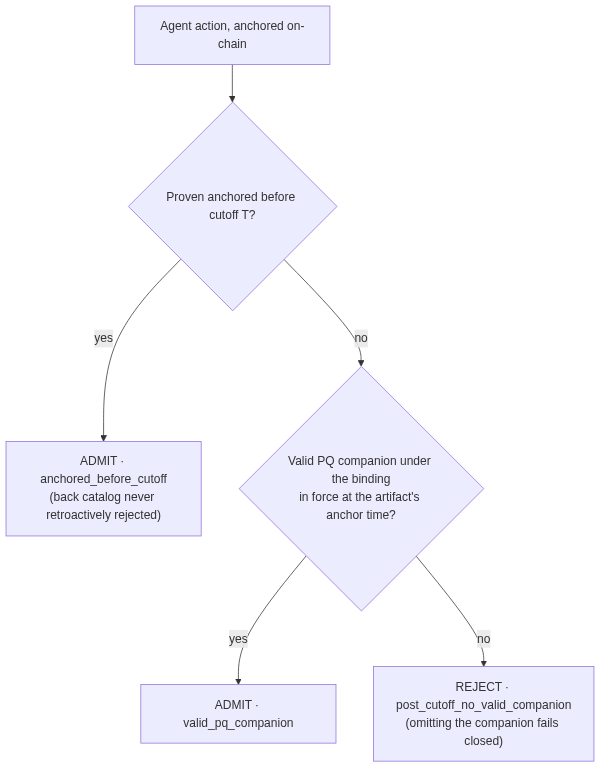
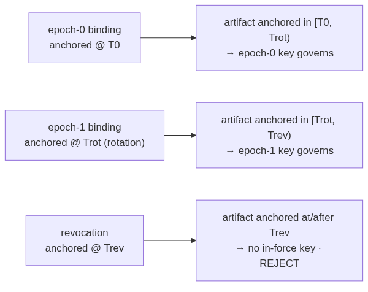
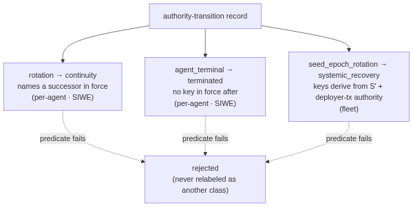
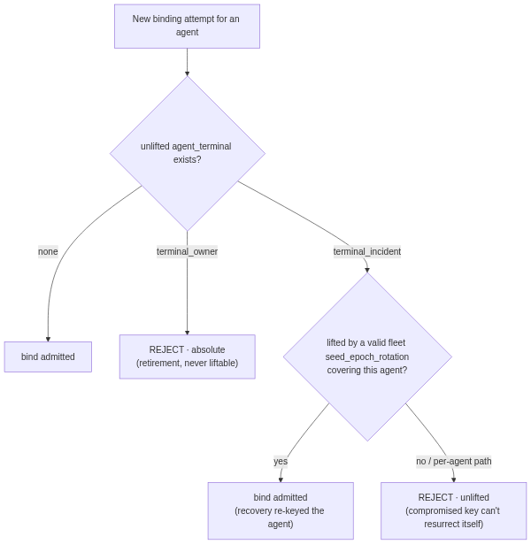

# pq-agent-binding

*Recomputable post-quantum key binding for on-chain AI agents — bind, anchor, attest, enforce a cutoff, rotate, revoke; every step re-derivable from public data.*

> **Don't trust. Recompute.** — including the migration off Shor-vulnerable signatures.

**Status:** reference spec extracted from a live, shipped implementation (2026-07/08). Home: this repo, in the `trustless-ai` org — arrived 2026-08-12. Companion to the recompute-verified `pq-key-binding-v0` shared spec.

---

## Why

Quantum computers break the **signatures** (ECDSA/RSA) under agent identity, finance, and public infrastructure — but leave hashes effectively intact (Grover, not Shor). So the migration problem is specifically the **signature layer**: how does an agent prove an action under a signature scheme that survives Shor — **without asking anyone to trust a provider**, and **without a flag day**?

This binds a post-quantum key to an agent identity such that every step is **independently recomputable from public data**. The only deliberately non-recomputable element is a single standing secret (the master seed), held offline / encrypted-at-rest.

## Design in one line

An agent's classical (ECDSA) identity gains a **PQ companion**: a post-quantum key, **owner-authorized**, **epoch-anchored**, carried on every attestation, and governed by a **load-bearing cutoff** — after which classical-only attestations are rejected — with **owner-driven rotation and revocation**. Dual-family (lattice **and** hash) so no single PQ assumption is load-bearing alone.

## Dual family (the hedge)

Two independent post-quantum families, both finalized NIST standards:
- **ML-DSA** (lattice, FIPS 204) — the primary per-agent signing key.
- **SLH-DSA** (hash, FIPS 205) — a hash-based companion for the attestor/KYA-L4 lane.

If one family is later weakened, the other still stands. Convergence surfaced at `/quantum`; primitives pinned (`@noble` 0.4.1).

## The binding lifecycle

Each step names what is **public + recomputable** vs what is **secret**.

**1. Keygen.** Per-agent ML-DSA keypair (+ SLH-DSA companion for the attestor lane). Public: the public keys. Secret: the private keys, derived from the master seed (the one standing secret; see below).

**2. Owner-authorized binding.** The agent's **owner** (proved via SIWE) authorizes binding a PQ public key to an **ERC-8004** agent id. The binding statement is a canonical record; anyone recomputes `binding_id` from it. No self-declaration — an agent cannot bind its own PQ key without the owner's authorization.

**3. Epoch anchor.** Agent bindings are batched into a **Merkle tree per epoch** and the root is anchored on-chain (amortized: one anchor covers many bindings; per-binding inclusion is a Merkle proof). Public + recomputable: the epoch root, each binding's inclusion proof.

**4. Per-attestation companion.** Every agent attestation carries a **PQ companion signature** over the same digest the classical signature covers. Recompute: verify the companion against the bound (and anchored) PQ key. The PQ signature rides *alongside* the classical one — no protocol fork.

**5. Cutoff enforcement (load-bearing).** A cutoff enforcer with three modes:
- `shadow` — record the PQ presence/validity, do not gate (migration warm-up).
- `amber` — surface "could not verify PQ" as a first-class state, do not reject.
- `reject` — after the cutoff, a classical-only (no valid PQ companion) attestation is **rejected**. Proven live with a real ML-DSA reject.
The mode + cutoff are themselves anchored statements; the decision is recomputable (was there a valid, in-force, anchored PQ companion as of the attestation's time?). Ships **inert** (`mode = shadow`) — nothing changes until an owner rotates.

**6. Rotation.** The owner (SIWE) rotates the PQ key: a **second binding** supersedes the first under an **in-force rule** (the latest owner-authorized, anchored binding as of `as_of` governs). Recomputable and append-only — the prior binding is preserved, not erased.

**7. Revocation.** An **anchored statement class** + a **temporal rule**: a revocation is its own anchored record; an attestation signed after the revocation's in-force time by the revoked key does not verify. The breach is **preserved, never rewritten** (a late/overturned outcome keeps its record — same discipline as captured-admission).

## Diagrams

Five decision paths, each showing where a claim is **rejected** rather than only
where it succeeds — the rejection edges are the load-bearing part.

### Dual family — what gets bound, and what proves possession

The classical secp256k1 key binds a post-quantum key across **both** NIST
families — ML-DSA-65 (FIPS 204, lattice) and SLH-DSA-192s (FIPS 205, hash). Both
canonicalize under JCS to a byte-compatible content address, anchored via
[`OCP.record()`](https://github.com/ethereum/ERCs/pull/1788) — the Observation
Commitment Protocol, ERC-8281 (Damon Zwicker). The anchoring transaction is sent by the classical key, so the
anchor itself is the proof of possession — not a separate assertion.

### The migration predicate — how an artifact is admitted

Two ways to be admitted, one way to fail:

- **`anchored_before_cutoff`** — proven anchored before cutoff T. The back
  catalogue is *never* retroactively rejected.
- **`valid_pq_companion`** — a valid companion under the binding in force **at
  the artifact's anchor time**, not at verification time.
- **`post_cutoff_no_valid_companion`** — rejected. Omitting the companion **fails
  closed**; a missing signature is not a passing check.

### In-force at anchor time

Which key governs depends on *when the artifact was anchored*, not when it is
read. An epoch-0 binding governs `[T0, Trot)`; a rotation at `Trot` governs
`[Trot, Trev)`; after a revocation at `Trev` there is **no in-force key** and the
artifact is rejected. Rotation supersedes without erasing — the prior binding is
preserved, append-only.

### Recovery classes — three, and they never relabel

An authority-transition record resolves to exactly one class:

| Class | Meaning | Authority |
|---|---|---|
| `rotation` | continuity — names a successor in force | per-agent, SIWE |
| `agent_terminal` | terminated — no key in force after | per-agent, SIWE |
| `seed_epoch_rotation` | systemic recovery — keys derive from `S'` | fleet, deployer-tx |

If a class's predicate fails, the record is **rejected** — never quietly
relabelled as a weaker class it does satisfy. That is the whole discipline: a
failed rotation does not become a "termination", it fails.

### Terminality — a compromised key cannot resurrect itself

A new binding is admitted only if no unlifted terminal covers the agent.
`terminal_owner` is **absolute** — retirement is never liftable.
`terminal_incident` is liftable *only* by a valid fleet `seed_epoch_rotation`
covering that agent: recovery has to be re-keyed from outside. The per-agent path
cannot lift it, because a compromised key authorising its own recovery is exactly
the attack.

## The one deliberate secret

Everything above is recomputable from public data **except** the **master seed** — the root from which per-agent keys derive. That is the *point*: it is the single standing secret, held **offline / encrypted-at-rest** (no plaintext env, no HSM required for the free tier), with a public **fingerprint** so its identity is checkable without exposing it. Back it up — it is the only copy.

## Recompute checklist (what anyone can re-derive)

- `binding_id` from the owner-authorized binding record.
- Epoch Merkle root + each binding's inclusion proof.
- Each attestation's PQ companion against the bound, anchored, in-force key.
- The cutoff decision: valid PQ companion present ∧ in-force ∧ anchored, as of the attestation's time.
- Rotation: the in-force binding as of any `as_of`.
- Revocation: whether a signature's time postdates an in-force revocation.

## Relation to the stack

- **ERC-8004** — the agent identity a PQ key binds to.
- **KYA-L4 attestor signature** — the dual-family (ML-DSA + SLH-DSA) production lane.
- **[ERC-8281, the Observation Commitment Protocol](https://github.com/ethereum/ERCs/pull/1788)
  (Damon Zwicker)** — epoch roots and statement classes are anchored through it. This
  spec does not re-implement anchoring; it depends on OCP's, and the recompute
  discipline it is built on.
- **captured-admission** — the append-only / preserve-the-breach discipline the rotation & revocation rules inherit.
- **`pq-key-binding-v0`** — the recompute-verified shared spec this formalizes.

## Reference

**The normative reference is the conformance suite, not any one codebase.**

[`trustless-ai/recompute-kit` → `conformance/pq-key-binding-v0/`](https://github.com/trustless-ai/recompute-kit/tree/main/conformance/pq-key-binding-v0)

| | |
|---|---|
| `pq-key-binding-v0.spec.md` | the shared cross-implementation profile |
| `gate.py` | recomputes the binding's self-verifying content address (hash-only lane) |
| `cutoff_enforce.py` | the cutoff decision |
| `*.vectors.json` | rotation · revocation · cutoff · per-agent-anchor |

Vectors define conformance; code only demonstrates it. Point an implementation at
the suite and you get an answer that does not depend on trusting either of us —
which is the whole claim this spec makes about itself.

### Two implementations already conform

The profile converged in the working group on 2026-07-30, and **two independent
implementations bind identically** under it:

- **invinoveritas** — Nostr verdicts, OTS → Bitcoin anchor
- **the KYA-L4 attestor** — gateway EIP-712, OCP → chain anchor

Different chains, different anchoring, different signature stacks, same binding.
That agreement is the reference — a second implementation reaching the same
content address is worth more than any amount of our own code being readable.

### The implementation this spec was extracted from

`pqAgent.ts` (keygen + owner-authorized binding), `pqEpoch.ts` (batch-Merkle
epoch anchor), `pqCutoff.ts` (the enforcer), and the
`/pq/agent/:r/:id/{enforce,rotation}/selftest` endpoints, live in the Vértice
agent gateway. That repository is **private** — it is a production service, not a
reference — and it is *an* implementation of this profile rather than the
definition of it. Conformance is decided by the suite above, which anyone can run.

## Acknowledgements

This formalizes **ERC-8373 — Post-Quantum Anchored Key Binding**, co-authored by:

- **@TMerlini / vertice.eth** — SLH-DSA attestor lane, live gateway enforcement,
  per-agent + recovery layers, reference implementation
- **@babyblueviper1** — ML-DSA implementation + verifier, blind-diffs
- **@pipavlo82** — failure-class + authority-domain design, conformance vectors
- **@blockbird** — independent verification, the standing UNVERIFIABLE lane,
  spec findings, on-chain anchor decode

Discussion: <https://ethereum-magicians.org/t/erc-8373-post-quantum-anchored-key-binding/29225>

Two of those deserve saying out loud, because they are what let this spec claim
"checkable, not asserted" rather than merely say it:

- The **blind-diffs and independent verification** were done by parties with no
  shared state — a second and third derivation, not a review of ours.
- The **standing UNVERIFIABLE lane** is the part most specs omit. Keeping a
  first-class "cannot verify" state, rather than collapsing it into pass or fail,
  is why the migration predicate can fail closed honestly.

**ERC-8281, the Observation Commitment Protocol (Damon Zwicker)** is what this
anchors through. Damon was not a co-author here, but the epoch anchor and every
anchored statement class stand on his protocol and its verification invariant —
so it belongs in the credits, not only in the dependency list.

Dual-family and cutoff/rotation/revocation semantics build on the working
group's captured-admission and KYA-L4 lines.

*Contributions credited by the exact thing each party did.*

---
*CC0. Extracted 2026-08-04 from Vértice / trustless-ai post-quantum work.*

*Maintained here in `trustless-ai` as a working-group artifact. The design and
reference implementation are **Vértice Criativo's contribution** to the group;
`verticecriativo/pq-agent-binding` is a fork of this repository, not a rival
copy — this one is canonical. Transferred 2026-08-12, which is what the previous
footer said would happen.*
